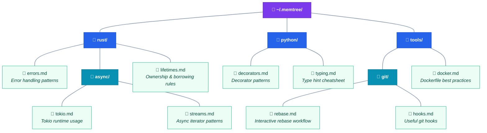

# memtree

Filesystem-based memory tree for AI agents. Persist memories on disk in a tree structure grouped by topic — agents keep top-level summaries in context and load deeper levels on demand.

## How It Looks



> **Purple** = tree root · **Blue** = topic directories · **Teal** = subdirectories · **Green** = memory leaves

## Install

```sh
cargo install --path .
```

## Quick Start

```sh
# Store a memory
memtree store --path rust/errors --summary "Error handling patterns" \
  --content "Use thiserror for library errors, anyhow for applications." \
  --tags rust,errors

# Store a directory summary
memtree store --path rust --summary "Rust programming topics"

# List the tree
memtree ls --depth 2
# rust/                    Rust programming topics
#   errors.md              Error handling patterns

# Recall a memory
memtree recall rust/errors

# Search across all memories
memtree search thiserror

# Move
memtree move rust/errors rust/error-handling

# Delete
memtree delete rust/error-handling
```

## Tree Root

Resolved in order:
1. `--root <path>` flag
2. `MEMTREE_ROOT` environment variable
3. `~/.memtree/` (default)

The root is auto-created on first write.

## On-Disk Format

```
<root>/
├── _summary.md              # root summary (plain text)
├── rust/
│   ├── _summary.md          # "Rust programming topics"
│   ├── errors.md            # leaf with YAML frontmatter + body
│   └── async/
│       ├── _summary.md
│       └── tokio.md
└── python/
    ├── _summary.md
    └── decorators.md
```

Leaf files have YAML frontmatter:

```markdown
---
summary: "Rust error handling patterns"
created: 2026-03-09T12:00:00Z
updated: 2026-03-09T12:00:00Z
tags: [rust, errors]
---

Use `thiserror` for library errors
and `anyhow` for application errors.
```

Directory summaries (`_summary.md`) are plain text.

## Commands

| Command | Description | Locks |
|---|---|---|
| `store --path <path> --summary <text> [--content <text>] [--tags t1,t2]` | Create/update a leaf (with content) or directory summary (without) | Yes |
| `recall <path> [--full]` | Print leaf body or directory summary + children | No |
| `ls [path] [--depth N]` | Tree listing with summaries | No |
| `search <query>` | Case-insensitive substring search across all leaves | No |
| `move <src> <dst>` | Move a leaf or subtree | Yes |
| `delete <path> [--force]` | Remove a leaf or subtree | Yes |

## Concurrency

Write commands acquire an exclusive flock on `<root>/.memtree.lock`. Read commands don't lock. Writes are atomic (temp file + rename), so readers never see partial content.

## Auto-Promotion

Storing a nested path under an existing leaf automatically promotes it to a directory. For example, storing at `rust/errors/handling` when `rust/errors.md` exists moves it to `rust/errors/errors.md` and creates the `rust/errors/` directory.

## Piping Content

Use `--content -` to read content from stdin:

```sh
echo "Memory content" | memtree store --path notes/idea --summary "An idea" --content -
```
